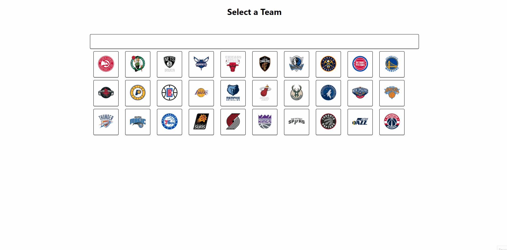

<h1 align="center">   NBA Deck 🏀</h1>

Just a little cool nba encloypedia/fan page that I made with using JSON data from https://thesportsdb.com/. You can select a team get and some pretty basic inoformation such as links to their eternal sites (socials, websites, stores) , geogrpahic info of a team and their stadium, as well as fan art! 

<h2 align="center">Tech Used</h2>

- ReactJS
- Material UI
- Context (state management)

<h2 align="center">Installation Instructions</h2>

- Fork and clone the repo to install it as your own remote.
- run: `npm install` to download all dependencies.
- run: `npm start` to start your local development server.

